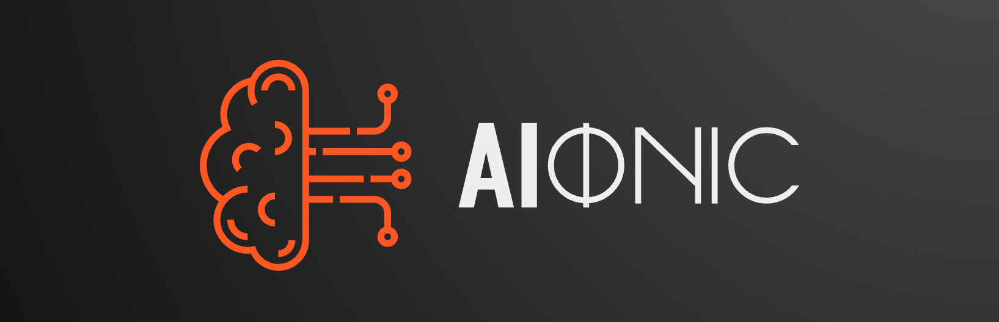

  <h1>AIonic</h1>
  

    
  

  

  
  
 
   

AIonic is a Rust library designed to interface seamlessly with a range of public
Language Model APIs, offering a streamlined, user-friendly experience. The name
AIonic not only encapsulates our focus on AI, but also alludes to 'ionic bonds'
— representing our mission to connect various elements of AI through a single
interface. In a sense, just like ionic bonds facilitate the flow of electrons,
AIonic promotes a seamless flow of data and functionality between different language
models, all within the vibrant, performant world of Rust.

## Examples

TODO

## Contributing

Contributions are welcome. Please open an issue to discuss your ideas before
making large changes.

## License

This project is licensed under the MIT License.
